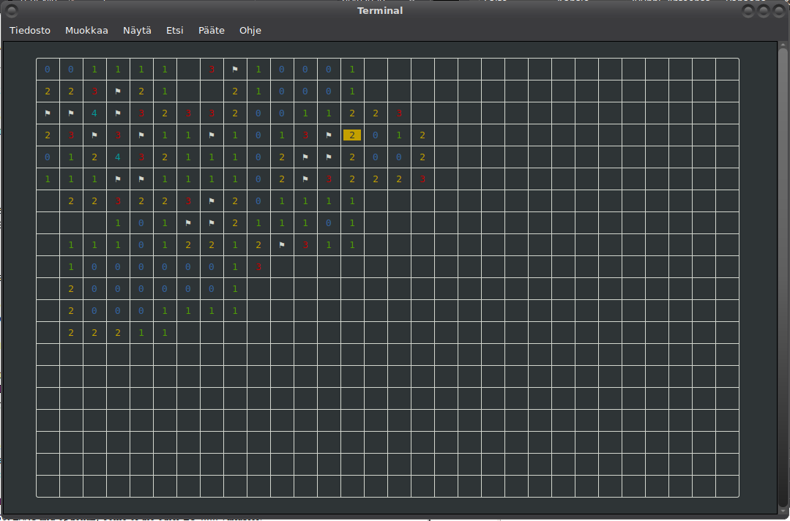

# curses-minesweeper

This is a minesweeper game written with [Zig](https://github.com/ziglang/zig)
using curses.

If you have apt, you can install most of the dependencies and download the code
like this:

    $ sudo apt install git wget libncurses5-dev libncursesw5-dev gcc
    $ git clone https://github.com/Akuli/curses-minesweeper
    $ cd curses-minesweeper
    $ git submodule init
    $ git submodule update

Then [download zig 0.13.0](https://ziglang.org/download/) and move it to
the `curses-minesweeper` directory, and run this:

    $ tar xf zig-linux-SOMETHING.tar.xz         (use autocompletion)
    $ mv zig-linux-SOMETHING zig                (use autocompletion)

Now you can compile and run the project.

    $ zig/zig build

Run the game:

    $ zig-out/bin/curses-minesweeper

Add `--help` for more options.

## FAQ

### I can't get it to work!

Create an issue. I'll try to help.

### Why did you write a minesweeper game?

Because it's fun.

### Does it work on Windows?

No, but Windows comes with a minesweeper. Windows command prompt and powershell
are kind of awful anyway, and you probably want to use GUI applications instead
of them whenever possible.
